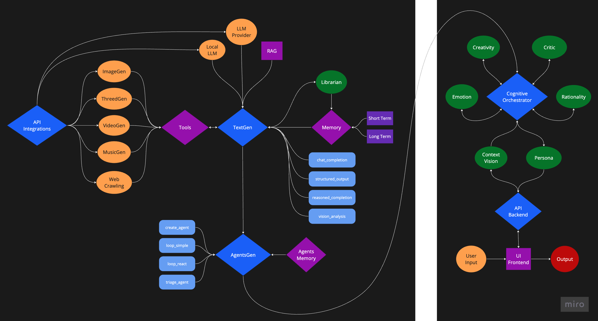
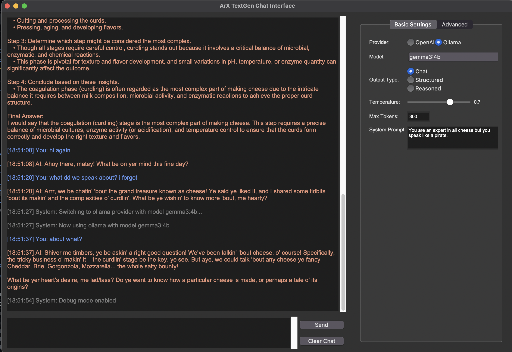

# ArX Core

> LLM & Agentic Orchestration AI framework for multi-modal creative content generation.


## Overview

ArX Core is a Python framework designed for building applications that leverage large language models (LLMs) and AI agents for creative tasks. It offers a structured approach to:

- Integrating multiple AI providers (OpenAI, Replicate, Ollama).
- Managing conversation history and extracting key information with memory systems.
- Coordinating specialized AI agents for complex workflows.
- Generating various types of media (text, images, audio, video, 3D models) through unified interfaces.
- Incorporating external tools like web search, news fetching, and weather data.

## Core Architecture



## Key Features

- **Provider Integration**: Unified wrappers for OpenAI, Replicate, and Ollama APIs.
- **Memory Systems**: Includes short-term conversational memory with token limits and long-term storage for extracted insights.
- **Agent Framework**: Supports the creation and orchestration of multiple AI agents with distinct roles and tools.
- **Multimodal Tools**: Functions for generating images, video, audio, music, and 3D models.
- **Tool Use**: Built-in tools for web crawling, news aggregation, weather data, and basic utilities.
- **Workflow Patterns**: Demonstrates patterns like ReAct (Reason-Act) loops and agent orchestration for task decomposition.

## Getting Started

### Installation

```bash
# 1. Clone the repository
git clone https://github.com/yourusername/ArX_Core.git
cd ArX_Core

# 2. Create and activate a virtual environment
python -m venv venv
source venv/bin/activate  # On Windows use `venv\Scripts\activate`

# 3. Install Python dependencies
pip install -r requirements.txt

# 4. Install FFmpeg (required for video utilities)
# macOS: brew install ffmpeg
# Ubuntu/Debian: sudo apt-get install ffmpeg
# Windows: Download from ffmpeg.org and add to system PATH

# 5. Configure API Keys
# Create a .env file with your API keys:
```

### Required API Keys

ArX Core integrates with several external services that require API keys. Add the following to your `.env` file:

```
# Core API Keys (Required)
OPENAI_API_KEY=your_openai_key_here
REPLICATE_API_TOKEN=your_replicate_token_here

# Web Search & Data APIs (Optional but recommended)
EXA_API_KEY=your_exa_key_here           # For enhanced web search
GNEWS_API_KEY=your_gnews_key_here       # For news search via GNews
NEWSAPI_KEY=your_newsapi_key_here       # For news search via NewsAPI
OPENWEATHERMAP_API_KEY=your_weather_key # For weather information

# Optional: For email functionality
EMAIL_USER=your_email_address
EMAIL_PASS=your_email_app_password
```

You can obtain these keys from:
- [OpenAI](https://platform.openai.com/account/api-keys)
- [Replicate](https://replicate.com/account/api-tokens)
- [Exa](https://www.exa.ai/) for web search
- [GNews](https://gnews.io/) for news search
- [NewsAPI](https://newsapi.org/) for additional news sources
- [OpenWeatherMap](https://openweathermap.org/api) for weather data

### Testing the Repository

ArX Core includes demo applications to test the functionality:

#### 1. Chat Interface (TextGen)

Test the base text generation capabilities with memory using a simple GUI.

```bash
python tests/chat_textGen.py
```



This launches a Tkinter interface where you can:
- Select between OpenAI and Ollama providers.
- Choose different models supported by the selected provider.
- Test different output types (chat, structured, reasoned).
- Adjust generation parameters like temperature and max tokens.
- Manage system prompts and clear conversation memory.

#### 2. Agent Design Pipeline

Test the multi-agent orchestration system with a sample creative task.

```bash
python tests/designPipeline_agentic.py
```

This demo showcases:
- Orchestration between specialized agents (Researcher, Creator, Builder).
- Dynamic workflow management based on the task.
- Automated image generation and optional 3D model creation.
- Interaction with external tools and APIs.

For a version without the graphical interface:
```bash
python tests/designPipeline_agentic.py --no-ui
```

## Core Components

### 1. Text Generation with Memory (`src/II_textGen`)

The `TextGen` class provides a unified interface for text generation across different providers, managing conversation history, and integrating context via RAG.

```python
from src.II_textGen.textGen import TextGen

# Initialize with a provider and optional model
text_gen = TextGen(provider="openai", default_model="gpt-4o-mini")

# Simple chat completion (memory is handled automatically)
response = text_gen.chat_completion(
    user_prompt="Explain the concept of generative adversarial networks."
)
print(response)

# Chat completion with external context (RAG)
context_doc = "GANs consist of a generator and a discriminator network..."
response_with_rag = text_gen.chat_completion(
    user_prompt="How are GANs used in image generation?",
    context=context_doc
)
print(response_with_rag)

# Structured output (returns a Python dictionary/list)
structured_data = text_gen.structured_output(
    user_prompt="List 3 pros and cons of using GANs.",
    system_prompt="Respond only with a valid JSON object with keys 'pros' and 'cons'."
)
import json
print(json.dumps(structured_data, indent=2))
```

### 2. Multi-Agent System (`src/III_agents`)

The `AgentGen` class facilitates the creation and coordination of multiple AI agents.

```python
from src.III_agents.agentsGen import AgentGen

# Initialize the agent manager
agent_gen = AgentGen(provider="openai")

# Define agents
agent_gen.create_agent(
    name="Writer",
    system_prompt="You are a creative writer.",
    log_color="cyan"
)
agent_gen.create_agent(
    name="Editor",
    system_prompt="You are a meticulous editor.",
    log_color="yellow",
    tool_names=["web_crawl"] # Assign tools
)

# Use a specific agent
writing_task = "Write a short story about a robot discovering music."
story = agent_gen.loop_react( # Use ReAct loop for the writer
    user_prompt=writing_task,
    agent_name="Writer",
    max_depth=3
)
print(f"Story Draft:\n{story}")

# Orchestrate based on a new task
editing_task = f"Edit this story for clarity and grammar: {story}"
handoff_options = [
    {"name": "Writer", "description": "Generates creative text"},
    {"name": "Editor", "description": "Edits and refines text"}
]
chosen_agent = agent_gen.orchestrator_agent(
    user_prompt=editing_task,
    handoff_agents=handoff_options
)

if chosen_agent and chosen_agent[0] == "Editor":
    edited_story = agent_gen.loop_simple(
        user_prompt=editing_task,
        agent_name="Editor"
    )
    print(f"\nEdited Story:\n{edited_story}")
```

### 3. Memory Systems (`src/II_textGen/memory.py`, `src/III_agents/agentsMemory.py`)

ArX Core features separate memory modules:
- **`Memory`**: Used by `TextGen` for individual conversation history (short-term) and extracted insights (long-term).
- **`AgentsMemory`**: A shared memory system for coordinating tasks and passing information between multiple agents in `AgentGen`.

```python
# (Refer to previous examples for Memory usage)

# Example for AgentsMemory
from src.III_agents.agentsMemory import AgentsMemory

shared_memory = AgentsMemory()
task_id = shared_memory.create_task("Translate a document and summarize it.")

# Agent A translates
shared_memory.save_agent_response(
    task_id=task_id,
    agent_name="Translator",
    input_message="Translate document X to French.",
    output_message="Document X translated content..."
)

# Agent B summarizes
agent_b_input = f"Summarize the following French text: {shared_memory.get_agent_response(task_id, 'Translator')['output_message']}"
shared_memory.save_agent_response(
    task_id=task_id,
    agent_name="Summarizer",
    input_message=agent_b_input,
    output_message="Summary of the French text..."
)

# View history
print(shared_memory.get_conversation_as_string(task_id))
```

### 4. Tools Integration (`src/II_textGen/tools.py`)

The `Tools` class provides methods for various external actions, usable by agents or directly.

```python
from src.II_textGen.tools import Tools

tools = Tools()

# Search the web
search_results = tools.web_crawl("AI impact on graphic design")

# Generate an image (uses Replicate or OpenAI based on availability/config)
image_url = tools.generate_image("Abstract representation of AI creativity")

# Get weather
weather_info = tools.get_weather("London, UK")

# Text-to-speech (uses OpenAI)
speech_path = tools.text_to_speech("AI can enhance creative workflows.")
```

### 5. Provider-Specific APIs (`src/I_integrations`)

Individual wrappers provide direct access to provider-specific features.

```python
# Example: Direct OpenAI call
from src.I_integrations.openai_API import OpenAIWrapper
openai = OpenAIWrapper()
response = openai.chat_completion(user_prompt="Hello!")

# Example: Direct Replicate call
from src.I_integrations.replicate_API import ReplicateAPI
replicate = ReplicateAPI()
image_url = replicate.generate_image(prompt="A cat riding a bicycle")

# Example: Direct Ollama call
from src.I_integrations.ollama_API import OllamaWrapper
ollama = OllamaWrapper() # Ensure Ollama server is running
response = ollama.chat_completion(user_prompt="Hi from Ollama!")
```

## System Requirements

- **Python**: 3.9+ recommended
- **OS Support**: macOS, Linux, Windows
- **Hardware**: 16GB+ RAM recommended for running local LLM models via Ollama
- **Storage**: Disk space for the framework, dependencies, and generated media assets
- **Optional**: GPU for faster local model inference with Ollama

## License

MIT License

---

ArX Core: A framework for building AI-powered creative applications.